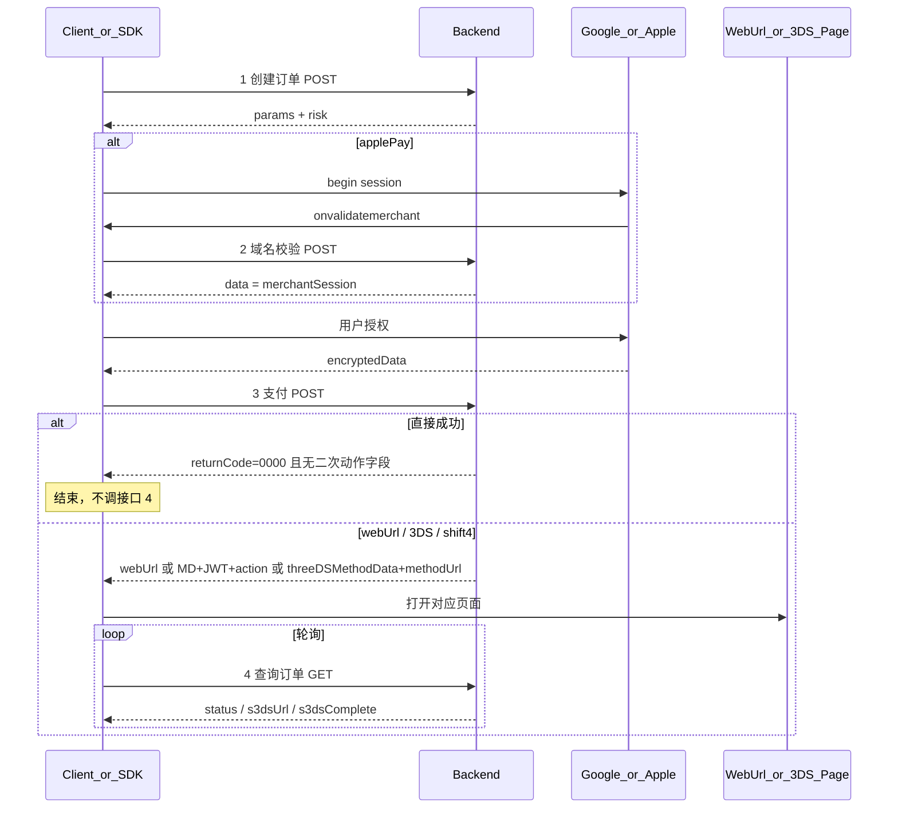

# 钱包支付 API 对接说明

前后端联调契约。类型与报文示例见本目录 TypeScript 文件。

| #   | 文件                                             | 方法     | 类型                                                   | 何时调用                           |
| --- | ------------------------------------------------ | -------- | ------------------------------------------------------ | ---------------------------------- |
| —   | [`common.ts`](./common.ts)                       | —        | `ApiResponse` / `OrderStatus` / `BillingAddress`       | 共用                               |
| 1   | [`create-order.ts`](./create-order.ts)           | **POST** | `CreateOrderRequest` → `CreateOrderResponse`           | 拿 `params` / `risk`，渲染钱包按钮 |
| 2   | [`validate-merchant.ts`](./validate-merchant.ts) | **POST** | `ValidateMerchantRequest` → `ValidateMerchantResponse` | 仅 Apple Pay，`onvalidatemerchant` |
| 3   | [`pay.ts`](./pay.ts)                             | **POST** | `PayRequest` → `PayResponse`                           | 钱包授权 + 风控采集完成后          |
| 4   | [`query-order.ts`](./query-order.ts)             | **GET**  | `QueryOrderRequest` → `QueryOrderResponse`             | **仅**接口 3 未直接成功时          |

> 仅接口 4 为 GET（`GET /v1/pay/orders/{orderId}`）；其余均为 POST。  
> 路径为建议值，以实际网关为准。入口：`import … from './pay-api'`（[`index.ts`](./index.ts)）。

---

## 1. 统一响应壳

四个接口共用；**业务字段一律在 `data` 内**。

```json
{
  "success": true,
  "returnCode": "0000",
  "returnMsg": "SUCCESS",
  "extend": "",
  "data": {},
  "traceId": "68b11d63f919cca7adbb4bbe57939df9"
}
```

| 字段         | 说明                              |
| ------------ | --------------------------------- |
| `returnCode` | `'0000'` 成功；**其他值均为失败** |
| `returnMsg`  | 失败时须向用户/日志吐出           |
| `success`    | 与 `returnCode` 对应的布尔标记    |
| `data`       | 成功时的业务载荷                  |
| `extend`     | 扩展字段，可空串                  |
| `traceId`    | 链路追踪                          |

客户端先判断 `returnCode === '0000'`，再解析 `data`（见 `ApiResponse` / `isApiSuccess`）。

---

## 2. 主流程



### 接口 3 支付结果分支

| 条件                                 | 客户端动作                                         | 是否轮询接口 4 |
| ------------------------------------ | -------------------------------------------------- | -------------- |
| `returnCode !== '0000'`              | 失败，吐出 `returnMsg`                             | **否**         |
| `data` 无二次动作字段                | 成功回调                                           | **否**         |
| 有 `webUrl`                          | 打开 `webUrl`（SDK 默认只 `onAction`，不强制跳转） | **是**         |
| 有 `MD` + `JWT` + `action`           | 打开 3DS 页（同上，可由商户 / `sdk.openAction`）   | **是**         |
| 有 `threeDSMethodData` + `methodUrl` | 打开 Shift4 方法页                                 | **是**         |

### 接口 4 轮询规则（建议间隔 2s）

1. 有 `s3dsUrl` → **跳转**该地址继续完成验证（轮询可继续）
2. `status` 为终态（`succeeded` / `failed`），或 `s3dsComplete === true` → **停止轮询**，通知商户跳转对应结果页
3. 否则继续轮询

---

## 3. 接口 1 — 创建订单

**POST** `/v1/pay/orders`

### 请求（暂冻结字段）

```ts
{
  amount: string
  currency: string
  countryCode: string
}
```

其余请求字段待定。见 `CreateOrderRequest`。

### 响应 `data`

| 字段                  | 说明                                                     |
| --------------------- | -------------------------------------------------------- |
| `orderId`             | 订单号，后续接口必带                                     |
| `method`              | `'googlePay'` \| `'applePay'`                            |
| `environment`         | 可选 `'TEST'` \| `'PRODUCTION'`，不传默认 `'PRODUCTION'` |
| `params`              | 钱包原生唤起参数（见下）                                 |
| `risk`                | 风控开关与可覆盖配置                                     |
| `validateMerchantUrl` | 仅 Apple Pay，可选；有值则覆盖 SDK 当前环境的接口 2 地址 |

#### `params` — Google Pay

`PaymentDataRequest`。`totalPriceLabel`、`merchantId`、`merchantName`、`callbackIntents` **必传**（当前钱包 SDK MVP 不消费 `PAYMENT_AUTHORIZATION`，示例用 `[]`）。

令牌化二选一：

- `tokenizationSpecification.type = 'DIRECT'` + `publicKey`
- `type = 'PAYMENT_GATEWAY'` + `gateway` / `gatewayMerchantId`

账单地址需要时带 `billingAddressRequired` + `billingAddressParameters`。

#### `params` — Apple Pay

创建 `ApplePaySession` 的 PaymentRequest（`countryCode` / `currencyCode` / `total` 等）。  
如需覆盖 SDK 内置地址，域名校验 URL 在顶层 `validateMerchantUrl`，**不在**
`params` 内。未返回时，SDK 按 `init.environment` 使用 `src/endpoints.ts` 中的地址。

#### `risk`（创建订单下发）

按厂商嵌套。`enabled` 控制是否采集；其余配置**有值覆盖 SDK 默认，无值用默认**（便于服务端热更新）。

| 块            | 可覆盖字段                               |
| ------------- | ---------------------------------------- |
| `fingerprint` | `apiKey`、`scriptUrlPattern`、`endpoint` |
| `forter`      | `siteId`                                 |
| `checkout`    | `publicKey`、`scriptUrl`、`integrity`    |
| `worldPay`    | `jwt`、`bin`、`actionUrl`                |

完整示例见 [`create-order.ts`](./create-order.ts)。

---

## 4. 接口 2 — Apple Pay 域名校验

**POST** 创建订单返回的 `validateMerchantUrl`；未返回时使用当前环境的内置地址。

### 请求

```ts
{ orderId?: string; validationURL: string }
```

`validationURL` 为 Apple `onvalidatemerchant` 原样转发。

### 响应

统一壳；`returnCode === '0000'` 时 **`data` 即为 `merchantSession`**（Apple opaque）。  
客户端：`completeMerchantValidation(response.data)`。

见 [`validate-merchant.ts`](./validate-merchant.ts)。

---

## 5. 接口 3 — 支付

**POST** `/v1/pay/payments`

### 请求

```ts
{
  orderId: string
  encryptedData: string | object  // GP 加密串 / AP payment.token
  billingAddress?: BillingAddress // 开启账单地址时
  risk?: {
    fingerprint?: { visitorId: string }
    forter?: { token: string }
    checkout?: { deviceSessionId: string }
    worldPay?: { sessionId: string }
  }
}
```

`BillingAddress`：`addressLine1`、`addressLine2`、`city`、`state`、`zip`、`country`、`firstName`、`lastName` 必传；`phone`、`email` 可选。

`risk` 仅上送创建订单里 `enabled === true` 的块。

### 响应 `data`

| 字段                              | 说明            |
| --------------------------------- | --------------- |
| `webUrl`                          | 普通跳转        |
| `MD` / `JWT` / `action`           | WorldPay 等 3DS |
| `threeDSMethodData` / `methodUrl` | Shift4 方法页   |

有二次动作字段则开页并轮询接口 4；都没有且 `returnCode=0000` 则直接成功。

见 [`pay.ts`](./pay.ts)。

---

## 6. 接口 4 — 查询订单状态

**GET** `/v1/pay/orders/{orderId}`

### 响应 `data`

| 字段            | 说明                                                      |
| --------------- | --------------------------------------------------------- |
| `orderId`       | 订单号                                                    |
| `status`        | `pending` \| `requires_action` \| `succeeded` \| `failed` |
| `failureReason` | 失败原因（可选）                                          |
| `s3dsUrl`       | 有则跳转继续 3DS 验证                                     |
| `s3dsComplete`  | `true` 时停止轮询并通知商户跳结果页                       |

见 [`query-order.ts`](./query-order.ts)。

---

## 7. 备注

- `environment`：钱包 + 风控共用；Google Pay 创建 `PaymentsClient` 时使用，不在 `params` 内。
- 含 `PAYMENT_AUTHORIZATION` 时须提供 `onPaymentAuthorized`，否则 sheet 会失败或卡住。
- 与历史 payment-hub 字段映射由服务端完成；联调以本目录为准。
