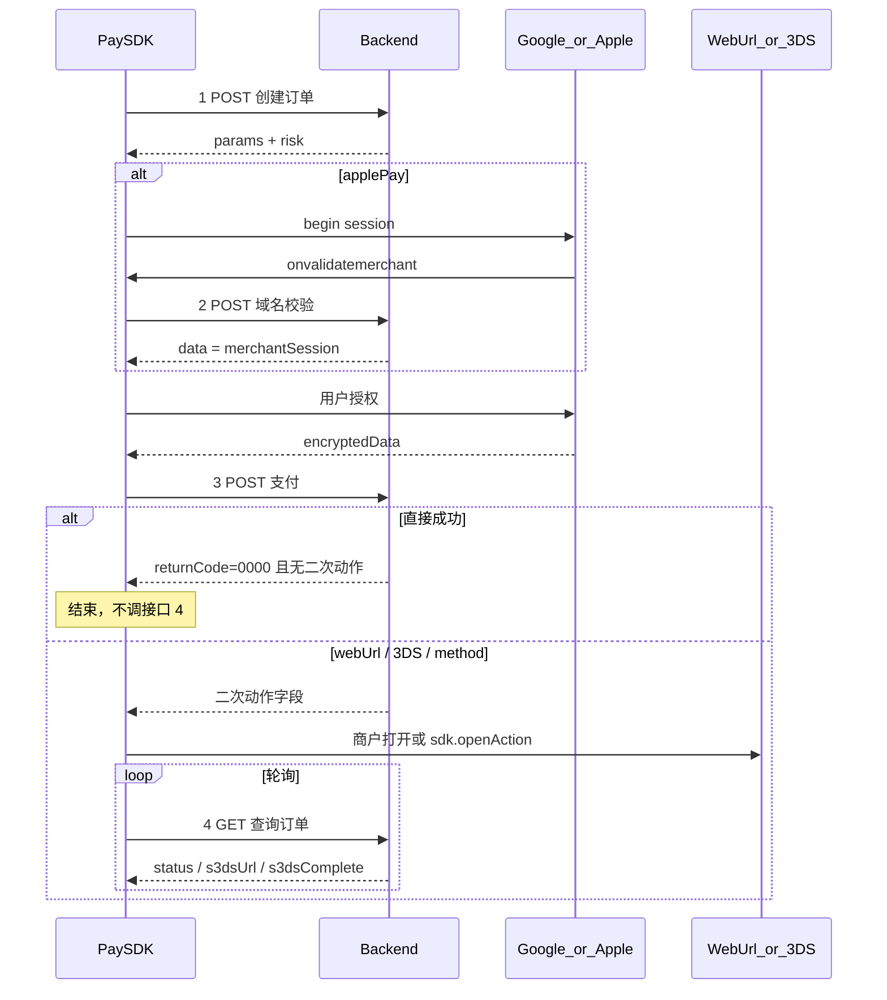

# 钱包支付 API — 服务端对接说明

本文是给**服务端**同学的完整接口说明：四个 HTTP 接口的类型、字段必选性与 JSON 示例。  
客户端为浏览器 / App WebView 中的 Pay SDK。联调以本文为准。

---

## 1. 接口一览

| #   | 方法     | 路径（建议）                             | 说明                           |
| --- | -------- | ---------------------------------------- | ------------------------------ |
| 1   | **POST** | `/v1/pay/orders`                         | 创建订单，返回钱包 params/risk |
| 2   | **POST** | `/pay/apple/domainName/verify`（可覆盖） | 仅 Apple Pay 域名校验          |
| 3   | **POST** | `/v1/pay/payments`                       | 提交钱包 token + 风控          |
| 4   | **GET**  | `/v1/pay/orders/{orderId}`               | 二次动作后轮询订单状态         |

仅接口 4 为 GET；其余均为 POST，`Content-Type: application/json`。

### 环境根域名（SDK 默认）

| 环境                 | API 根域名                        |
| -------------------- | --------------------------------- |
| `TEST`               | `https://api-test.alchemytech.cc` |
| `PRODUCTION`（默认） | `https://api.alchemypay.org`      |

完整 URL = 根域名 + 上表路径。商户也可在 SDK `init.api` 中覆盖个别地址。

Apple 域名校验默认：

- TEST：`https://api-test.alchemytech.cc/pay/apple/domainName/verify`
- PRODUCTION：`https://api.alchemypay.org/pay/apple/domainName/verify`

创建订单若返回 `validateMerchantUrl`，SDK 优先用响应值。

---

## 2. 统一响应壳 `ApiResponse`

四个接口共用。**业务字段一律在 `data` 内。**

| 字段         | 类型      | 必填 | 说明                                |
| ------------ | --------- | ---- | ----------------------------------- |
| `success`    | `boolean` | 是   | 与业务是否成功对应的布尔标记        |
| `returnCode` | `string`  | 是   | `'0000'` = 成功；**其他值均为失败** |
| `returnMsg`  | `string`  | 是   | 失败时须可展示 / 记日志             |
| `extend`     | `string`  | 否   | 扩展，可空串                        |
| `data`       | `object`  | 是   | 成功时的业务载荷；失败时可 `{}`     |
| `traceId`    | `string`  | 否   | 链路追踪                            |

客户端规则：先判断 `returnCode === '0000'`，再解析 `data`。

### 成功示例

```json
{
  "success": true,
  "returnCode": "0000",
  "returnMsg": "SUCCESS",
  "extend": "",
  "data": {},
  "traceId": "68b11d63f919cca7adbb4bbe57939df9"
}
```

### 失败示例

```json
{
  "success": false,
  "returnCode": "1001",
  "returnMsg": "order not found",
  "extend": "",
  "data": {},
  "traceId": "68b11d63f919cca7adbb4bbe57939df9"
}
```

---

## 3. 主流程



---

## 4. 接口 1 — 创建订单

**POST** `/v1/pay/orders`

SDK 在 `ready()` 时调用；用响应渲染 Google / Apple 按钮，并按 `risk.*.enabled` **立即预采集**风控。

### 4.1 请求 `CreateOrderRequest`

| 字段          | 类型     | 必填 | 说明               |
| ------------- | -------- | ---- | ------------------ |
| `amount`      | `string` | 是   | 金额，如 `"10.00"` |
| `currency`    | `string` | 是   | 货币，如 `"USD"`   |
| `countryCode` | `string` | 是   | 国家，如 `"US"`    |

其余请求字段暂未冻结。

```json
{
  "amount": "10.00",
  "currency": "USD",
  "countryCode": "US"
}
```

### 4.2 响应 `data` — 共用字段

`method` 决定 `params` 形态（二选一）。

| 字段                  | 类型              | 必填          | 说明                                       |
| --------------------- | ----------------- | ------------- | ------------------------------------------ |
| `orderId`             | `string`          | 是            | 订单号，后续接口必带                       |
| `method`              | `'googlePay'      | 'applePay'`   | 是                                         | 钱包类型                                                           |
| `environment`         | `'TEST'           | 'PRODUCTION'` | 否                                         | 不传时 SDK 按 init 或默认 `PRODUCTION`；影响 Google Pay / Checkout |
| `params`              | `object`          | 是            | 见下节                                     |
| `risk`                | `CreateOrderRisk` | 否            | 风控开关与可覆盖配置                       |
| `validateMerchantUrl` | `string`          | 否            | **仅 Apple**；有值覆盖 SDK 内置接口 2 地址 |

### 4.3 `params` — Google Pay（`PaymentDataRequest`）

| 字段 / 路径                                               | 必填 | 说明                                                               |
| --------------------------------------------------------- | ---- | ------------------------------------------------------------------ |
| `apiVersion` / `apiVersionMinor`                          | 是   | 一般为 `2` / `0`                                                   |
| `merchantInfo.merchantId`                                 | 是*  | TEST 未下发时 SDK 默认 `12345678901234567890`                      |
| `merchantInfo.merchantName`                               | 是*  | TEST 未下发时 SDK 默认 `Example Merchant`                          |
| `transactionInfo.totalPrice`                              | 是   | 与订单金额一致                                                     |
| `transactionInfo.currencyCode` / `countryCode`            | 是   |                                                                    |
| `transactionInfo.totalPriceStatus`                        | 是   | 如 `"FINAL"`                                                       |
| `transactionInfo.totalPriceLabel`                         | 是   | 如 `"Total"`                                                       |
| `allowedPaymentMethods[0].type`                           | 是   | `"CARD"`                                                           |
| `allowedPaymentMethods[0].parameters.allowedAuthMethods`  | 是   | 如 `["PAN_ONLY","CRYPTOGRAM_3DS"]`                                 |
| `allowedPaymentMethods[0].parameters.allowedCardNetworks` | 是   | 如 `["MASTERCARD","VISA"]`                                         |
| `tokenizationSpecification`                               | 是   | 见下「令牌化」                                                     |
| `billingAddressRequired` + `billingAddressParameters`     | 否   | 需要账单地址时带上                                                 |
| `callbackIntents`                                         | 否   | **SDK 固定覆盖为** `["PAYMENT_AUTHORIZATION"]`，服务端下发会被改写 |

TEST 环境缺省时 SDK 会补齐；PRODUCTION 请务必下发真实商户信息。

**令牌化二选一：**

1. `type: "DIRECT"` + `parameters: { protocolVersion, publicKey }`
2. `type: "PAYMENT_GATEWAY"` + `parameters: { gateway, gatewayMerchantId }`

- TEST 缺省时 SDK 默认 `gateway=unlimint`，`gatewayMerchantId=googletest`

#### Google Pay 完整响应示例（PAYMENT_GATEWAY + risk）

```json
{
  "success": true,
  "returnCode": "0000",
  "returnMsg": "SUCCESS",
  "extend": "",
  "traceId": "68b11d63f919cca7adbb4bbe57939df9",
  "data": {
    "orderId": "ord_xxx",
    "environment": "TEST",
    "method": "googlePay",
    "params": {
      "apiVersion": 2,
      "apiVersionMinor": 0,
      "allowedPaymentMethods": [
        {
          "type": "CARD",
          "parameters": {
            "allowedAuthMethods": ["PAN_ONLY", "CRYPTOGRAM_3DS"],
            "allowedCardNetworks": ["MASTERCARD", "VISA"]
          },
          "tokenizationSpecification": {
            "type": "PAYMENT_GATEWAY",
            "parameters": {
              "gateway": "unlimint",
              "gatewayMerchantId": "googletest"
            }
          }
        }
      ],
      "transactionInfo": {
        "countryCode": "US",
        "currencyCode": "USD",
        "totalPriceStatus": "FINAL",
        "totalPrice": "10.00",
        "totalPriceLabel": "Total"
      },
      "merchantInfo": {
        "merchantId": "12345678901234567890",
        "merchantName": "Example Merchant"
      },
      "callbackIntents": ["PAYMENT_AUTHORIZATION"]
    },
    "risk": {
      "fingerprint": { "enabled": true },
      "forter": { "enabled": true },
      "checkout": { "enabled": true },
      "worldPay": { "enabled": true, "jwt": "your-worldpay-ddc-jwt" }
    }
  }
}
```

### 4.4 `params` — Apple Pay

| 字段                              | 必填 | 说明                                                      |
| --------------------------------- | ---- | --------------------------------------------------------- |
| `countryCode` / `currencyCode`    | 是   |                                                           |
| `merchantCapabilities`            | 是   | 如 `["supports3DS","supportsCredit","supportsDebit"]`     |
| `supportedNetworks`               | 是   | 如 `["masterCard","visa"]`                                |
| `total.label` / `type` / `amount` | 是   | `type` 如 `"final"`                                       |
| `requiredBillingContactFields`    | 否   | 需要账单时，如 `["name","postalAddress","phone","email"]` |

域名校验 URL 在响应**顶层** `validateMerchantUrl`（可选），**不在** `params` 内。

#### Apple Pay 完整响应示例

```json
{
  "success": true,
  "returnCode": "0000",
  "returnMsg": "SUCCESS",
  "extend": "",
  "traceId": "68b11d63f919cca7adbb4bbe57939df9",
  "data": {
    "orderId": "ord_xxx",
    "environment": "TEST",
    "method": "applePay",
    "validateMerchantUrl": "https://api-test.alchemytech.cc/pay/apple/domainName/verify",
    "params": {
      "countryCode": "US",
      "currencyCode": "USD",
      "merchantCapabilities": ["supports3DS", "supportsCredit", "supportsDebit"],
      "supportedNetworks": ["masterCard", "visa"],
      "total": {
        "label": "ALCHEMY GPS EUROPE UAB",
        "type": "final",
        "amount": "10.00"
      }
    },
    "risk": {
      "fingerprint": { "enabled": false },
      "forter": { "enabled": false },
      "checkout": { "enabled": false },
      "worldPay": { "enabled": false }
    }
  }
}
```

### 4.5 `risk`（创建订单下发）

按厂商嵌套。仅 `enabled === true` 时 SDK 才会采集；配置字段**有值覆盖 SDK 默认，无值用默认**。

| 块            | 可覆盖字段                               | 仅 `{ "enabled": true }`              |
| ------------- | ---------------------------------------- | ------------------------------------- |
| `fingerprint` | `apiKey`、`scriptUrlPattern`、`endpoint` | 可用内置默认                          |
| `forter`      | `siteId`                                 | 可用内置默认                          |
| `checkout`    | `publicKey`、`scriptUrl`、`integrity`    | 可用内置默认（按环境选沙盒/生产 key） |
| `worldPay`    | `jwt`、`bin`、`actionUrl`                | **不行**：至少需要动态 `jwt` 才能采集 |

支付接口上送的采集结果见接口 3 的 `risk`。

---

## 5. 接口 2 — Apple Pay 域名校验

**POST** `{validateMerchantUrl}`  
（创建订单未返回时使用当前环境内置地址。）

仅 `method === 'applePay'` 时调用。服务端用 Merchant Identity 证书向 Apple `validationURL` 换 session，原样放入响应 `data`。

### 5.1 请求 `ValidateMerchantRequest`

| 字段            | 类型     | 必填 | 说明                                |
| --------------- | -------- | ---- | ----------------------------------- |
| `orderId`       | `string` | 否   | 建议带上，便于审计                  |
| `validationURL` | `string` | 是   | Apple `onvalidatemerchant` 原样转发 |

```json
{
  "orderId": "ord_xxx",
  "validationURL": "https://apple-pay-gateway.apple.com/paymentservices/startSession"
}
```

### 5.2 响应

统一壳；`returnCode === '0000'` 时 `**data` 即为 Apple opaque `merchantSession**`（字段对商户不透明，原样返回即可）。

```json
{
  "success": true,
  "returnCode": "0000",
  "returnMsg": "SUCCESS",
  "extend": "",
  "data": {
    "epochTimestamp": 1620000000000,
    "expiresAt": 1620000300000,
    "merchantSessionIdentifier": "...",
    "nonce": "...",
    "merchantIdentifier": "...",
    "domainName": "pay.example.com",
    "displayName": "Example Merchant",
    "signature": "..."
  },
  "traceId": "68b11d63f919cca7adbb4bbe57939df9"
}
```

客户端：`completeMerchantValidation(response.data)`。

---

## 6. 接口 3 — 支付

**POST** `/v1/pay/payments`

钱包授权完成后调用。先看外层 `returnCode`，再看 `data` 是否含二次动作字段。

### 6.1 请求 `PayRequest`

| 字段             | 类型             | 必填    | 说明                                     |
| ---------------- | ---------------- | ------- | ---------------------------------------- |
| `orderId`        | `string`         | 是      |                                          |
| `encryptedData`  | `string          | object` | 是                                       | Google：加密 token 字符串；Apple：`payment.token` 对象或序列化串 |
| `billingAddress` | `BillingAddress` | 否      | 创建订单要求账单地址时 SDK 会带上        |
| `risk`           | `PayRiskPayload` | 否      | 仅包含创建订单里 `enabled === true` 的块 |

#### `BillingAddress`

| 字段           | 必填 |
| -------------- | ---- |
| `addressLine1` | 是   |
| `addressLine2` | 是   |
| `city`         | 是   |
| `state`        | 是   |
| `zip`          | 是   |
| `country`      | 是   |
| `firstName`    | 是   |
| `lastName`     | 是   |
| `phone`        | 否   |
| `email`        | 否   |

#### `PayRiskPayload`（采集结果）

| 字段                       | 说明                |
| -------------------------- | ------------------- |
| `fingerprint.visitorId`    | Fingerprint         |
| `forter.token`             | Forter              |
| `checkout.deviceSessionId` | Checkout Risk.js    |
| `worldPay.sessionId`       | WorldPay / Cardinal |

#### 请求示例

```json
{
  "orderId": "ord_xxx",
  "encryptedData": "...google-pay-encrypted-token...",
  "billingAddress": {
    "addressLine1": "1 Main St",
    "addressLine2": "",
    "city": "San Francisco",
    "state": "CA",
    "zip": "94105",
    "country": "US",
    "firstName": "Jane",
    "lastName": "Doe",
    "phone": "+1...",
    "email": "jane@example.com"
  },
  "risk": {
    "fingerprint": { "visitorId": "your-visitor-id" },
    "forter": { "token": "your-forter-token" },
    "checkout": { "deviceSessionId": "dsid_..." },
    "worldPay": { "sessionId": "your-worldpay-sessionId" }
  }
}
```

### 6.2 响应 `data` — `PayResponse`

二次动作字段**成组出现**；都没有且 `returnCode=0000` → 直接成功，**不调**接口 4。

| 字段组                                        | 说明            |
| --------------------------------------------- | --------------- |
| （无下列字段）                                | 直接成功        |
| `webUrl`                                      | 普通跳转页      |
| `MD` + `JWT` + `action`（三者都要）           | WorldPay 等 3DS |
| `threeDSMethodData` + `methodUrl`（两者都要） | Shift4 等方法页 |

| 条件                                   | 客户端行为                  | 是否轮询接口 4 |
| -------------------------------------- | --------------------------- | -------------- |
| `returnCode !== '0000'`                | 失败，展示 `returnMsg`      | 否             |
| `data` 无二次动作字段                  | 成功结束                    | 否             |
| 有 `webUrl`                            | `onAction` / 打开 webUrl    | 是             |
| 有完整 `MD`+`JWT`+`action`             | `onAction` / 打开 3DS       | 是             |
| 有完整 `threeDSMethodData`+`methodUrl` | `onAction` / 打开 method 页 | 是             |

#### 直接成功

```json
{
  "success": true,
  "returnCode": "0000",
  "returnMsg": "SUCCESS",
  "extend": "",
  "data": {},
  "traceId": "68b11d63f919cca7adbb4bbe57939df9"
}
```

#### webUrl

```json
{
  "success": true,
  "returnCode": "0000",
  "returnMsg": "SUCCESS",
  "extend": "",
  "data": {
    "webUrl": "https://psp.example/checkout/xxx"
  },
  "traceId": "68b11d63f919cca7adbb4bbe57939df9"
}
```

#### 3DS（MD / JWT / action）

```json
{
  "success": true,
  "returnCode": "0000",
  "returnMsg": "SUCCESS",
  "extend": "",
  "data": {
    "MD": "...",
    "JWT": "...",
    "action": "https://acs.example/challenge"
  },
  "traceId": "68b11d63f919cca7adbb4bbe57939df9"
}
```

#### Shift4 method

```json
{
  "success": true,
  "returnCode": "0000",
  "returnMsg": "SUCCESS",
  "extend": "",
  "data": {
    "threeDSMethodData": "...",
    "methodUrl": "https://psp.example/3ds-method"
  },
  "traceId": "68b11d63f919cca7adbb4bbe57939df9"
}
```

---

## 7. 接口 4 — 查询订单状态

**GET** `/v1/pay/orders/{orderId}`

**仅**接口 3 进入二次动作后需要。SDK 默认约每 2s 轮询，最长约 5 分钟。

### 7.1 响应 `data` — `QueryOrderResponse`

| 字段            | 类型       | 必填              | 说明                       |
| --------------- | ---------- | ----------------- | -------------------------- |
| `orderId`       | `string`   | 是                |                            |
| `status`        | `'pending' | 'requires_action' | 'succeeded'                | 'failed'` | 是  |     |
| `failureReason` | `string`   | 否                | 失败原因                   |
| `s3dsUrl`       | `string`   | 否                | 有值：继续 3DS（可仍轮询） |
| `s3dsComplete`  | `boolean`  | 否                | `true`：停止轮询并结束编排 |

### 7.2 轮询停止规则（客户端）

在外层 `returnCode === '0000'` 时：

1. 出现新的 `s3dsUrl` → 通知商户打开该 URL（轮询可继续）
2. `status` 为 `succeeded` / `failed`，或 `s3dsComplete === true` → **停止轮询**
3. 否则继续轮询

### 7.3 示例

**进行中**

```json
{
  "success": true,
  "returnCode": "0000",
  "returnMsg": "SUCCESS",
  "extend": "",
  "data": {
    "orderId": "ord_xxx",
    "status": "pending",
    "s3dsComplete": false
  },
  "traceId": "68b11d63f919cca7adbb4bbe57939df9"
}
```

**轮询中出现 s3dsUrl**

```json
{
  "success": true,
  "returnCode": "0000",
  "returnMsg": "SUCCESS",
  "extend": "",
  "data": {
    "orderId": "ord_xxx",
    "status": "requires_action",
    "s3dsUrl": "https://acs.example/challenge",
    "s3dsComplete": false
  },
  "traceId": "68b11d63f919cca7adbb4bbe57939df9"
}
```

**成功**

```json
{
  "success": true,
  "returnCode": "0000",
  "returnMsg": "SUCCESS",
  "extend": "",
  "data": {
    "orderId": "ord_xxx",
    "status": "succeeded",
    "s3dsComplete": true
  },
  "traceId": "68b11d63f919cca7adbb4bbe57939df9"
}
```

**失败**

```json
{
  "success": true,
  "returnCode": "0000",
  "returnMsg": "SUCCESS",
  "extend": "",
  "data": {
    "orderId": "ord_xxx",
    "status": "failed",
    "failureReason": "authentication_failed",
    "s3dsComplete": true
  },
  "traceId": "68b11d63f919cca7adbb4bbe57939df9"
}
```

> 注意：上例失败时外层仍可为 `returnCode=0000`（查询接口调用成功），业务失败看 `data.status === 'failed'`。

---

## 8. 服务端实现检查清单

- 四个接口均返回统一壳；业务成功时 `returnCode` 必须为 `"0000"`
- 失败时写清 `returnMsg`，便于客户端展示与排查
- 创建订单 `method` + `params` 足以让 SDK 渲染对应钱包按钮
- Google：`merchantInfo`、`transactionInfo`、`tokenizationSpecification` 齐全；TEST 可用 SDK 默认补齐
- Google：`callbackIntents` 可下发也可不下发，SDK 固定为 `["PAYMENT_AUTHORIZATION"]`
- Apple：`validateMerchantUrl` 可选；接口 2 的 `data` 为 Apple opaque session
- `risk`：按需 `enabled`；WorldPay 开启时务必下发动态 `jwt`
- 支付响应二次动作字段成组完整（`MD+JWT+action` 或 `threeDSMethodData+methodUrl`），不要半套
- 有二次动作时，查询接口能推进到 `succeeded` / `failed` 或 `s3dsComplete: true`
- 与历史 payment-hub 字段映射由服务端完成；对 SDK 暴露面以本文为准
