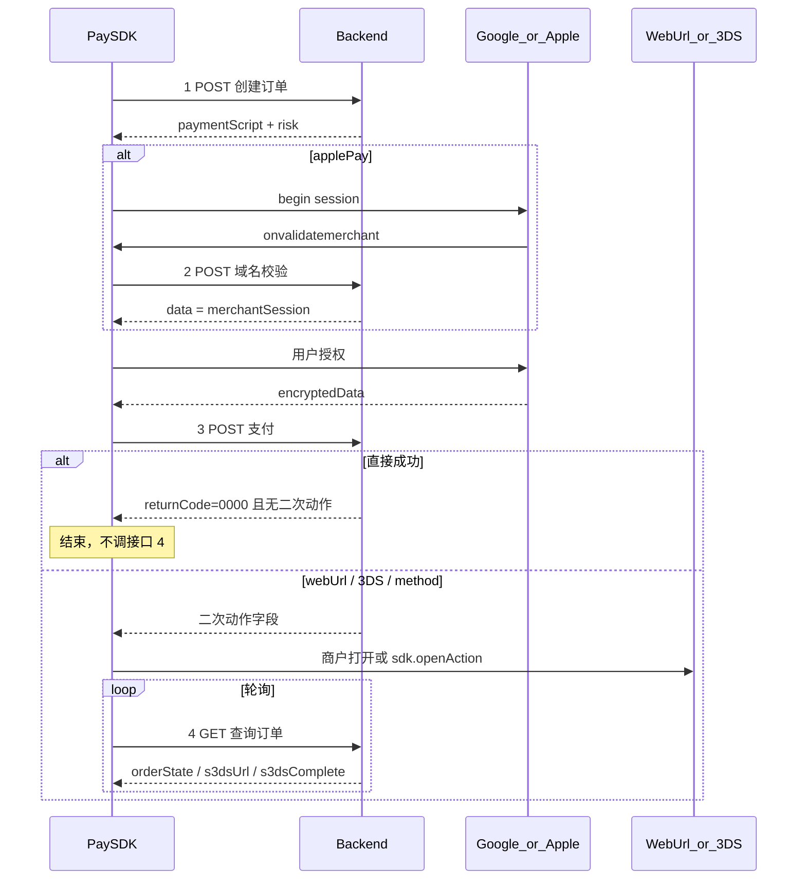

# 钱包支付 API — 服务端对接说明

本文是给**服务端**同学的完整接口说明：四个 HTTP 接口的类型、字段必选性与 JSON 示例。  
客户端为浏览器 / App WebView 中的 Pay SDK。联调以本文为准。

---

## 1. 接口一览

| #   | 方法     | 路径                                  | 说明                                   |
| --- | -------- | ------------------------------------- | -------------------------------------- |
| 0   | **POST** | `/open/api/v4/merchant/getToken`      | 获取免登 accessToken（建议服务端调用） |
| 1   | **POST** | `/open/api/v4/merchant/order/create`  | 创建订单，返回钱包 paymentScript/risk  |
| 2   | **POST** | `/open/api/v4/merchant/domain/verify` | 仅 Apple Pay 域名校验                  |
| 3   | **POST** | `/open/api/v4/merchant/alchemy-pay`   | 提交钱包 token + 风控                  |
| 4   | **GET**  | `/open/api/v4/merchant/order/detail`  | 二次动作后轮询订单状态                 |

接口 0 仅需签名头；接口 1–4 另需请求头 **`access-token`**（来自接口 0 的 `accessToken`）。接口 4 为 GET，query 参数 **`orderNo`**；其余均为 POST，`Content-Type: application/json`。

### 公共请求头

| Header           | 说明                                                                                |
| ---------------- | ----------------------------------------------------------------------------------- |
| `Content-Type`   | POST 时为 `application/json`                                                        |
| `access-token`   | 业务接口（1–4）设计上可带；**TEMP：** 当前联调服务端暂不校验，SDK 已暂时不带头      |
| `appid`          | 合作方标识；SDK 在配置了 `api.appId` + `api.appSecret` 时自动带上（头名 `appid`）   |
| `timestamp`      | 十三位毫秒时间戳；与签名串一致                                                      |
| `sign`           | HMAC-SHA256 + Base64；算法见 [API Sign](https://alchemypay.readme.io/docs/api-sign) |
| `fingerprint-id` | SDK 在 `init` 时用内置默认采集的 Fingerprint `visitorId`；失败时可能不传            |
| （其它自定义）   | 可由商户在 SDK `api.headers` 中追加                                                 |

Fingerprint **不**出现在创建订单响应或支付 body 中，服务端一律从请求头读取。

### 环境根域名（SDK 默认）

| 环境                 | API 根域名                        |
| -------------------- | --------------------------------- |
| `TEST`               | `https://api-test.alchemytech.cc` |
| `PRODUCTION`（默认） | `https://openapi.alchemypay.org`  |

完整 URL = 根域名 + 上表路径。商户也可在 SDK `init.api` 中覆盖个别地址。

Apple 域名校验默认：

- TEST：`https://api-test.alchemytech.cc/open/api/v4/merchant/domain/verify`
- PRODUCTION：`https://openapi.alchemypay.org/open/api/v4/merchant/domain/verify`

创建订单若返回 `validateMerchantUrl`，SDK 优先用响应值。

---

## 2. 统一响应壳 `ApiResponse`

四个接口共用。**业务字段一律在 `data` 内。**

| 字段         | 类型      | 必填 | 说明                                |
| ------------ | --------- | ---- | ----------------------------------- |
| `success`    | `boolean` | 是   | 与业务是否成功对应的布尔标记        |
| `returnCode` | `string`  | 是   | `'0000'` = 成功；**其他值均为失败** |
| `returnMsg`  | `string`  | 是   | 失败时须可展示 / 记日志             |
| `extend`     | `string`  | 否   | 扩展，可空串                        |
| `data`       | `object`  | 是   | 成功时的业务载荷；失败时可 `{}`     |
| `traceId`    | `string`  | 否   | 链路追踪                            |

客户端规则：先判断 `returnCode === '0000'`，再解析 `data`。

### 成功示例

```json
{
  "success": true,
  "returnCode": "0000",
  "returnMsg": "SUCCESS",
  "extend": "",
  "data": {},
  "traceId": "68b11d63f919cca7adbb4bbe57939df9"
}
```

### 失败示例

```json
{
  "success": false,
  "returnCode": "1001",
  "returnMsg": "order not found",
  "extend": "",
  "data": {},
  "traceId": "68b11d63f919cca7adbb4bbe57939df9"
}
```

---

## 3. 主流程


```mermaid
sequenceDiagram
  participant SDK as PaySDK
  participant API as Backend
  participant Wallet as Google_or_Apple
  participant Page as WebUrl_or_3DS

  SDK->>API: 1 POST 创建订单
  API-->>SDK: paymentScript + risk
  alt applePay
    SDK->>Wallet: begin session
    Wallet->>SDK: onvalidatemerchant
    SDK->>API: 2 POST 域名校验
    API-->>SDK: data = merchantSession
  end
  SDK->>Wallet: 用户授权
  Wallet-->>SDK: encryptedData
  SDK->>API: 3 POST 支付
  alt 直接成功
    API-->>SDK: returnCode=0000 且无二次动作
    Note over SDK: 结束，不调接口 4
  else webUrl / 3DS / method
    API-->>SDK: 二次动作字段
    SDK->>Page: 商户打开或 sdk.openAction
    loop 轮询
      SDK->>API: 4 GET 查询订单
      API-->>SDK: orderState / s3dsUrl / s3dsComplete
    end
  end
```

---

## 4. 接口 1 — 创建订单

**POST** `/open/api/v4/merchant/order/create`

SDK 在 `ready()` 时调用；用响应渲染 Google / Apple 按钮，并按 `risk.*.enabled` **立即预采集**风控。

### 4.1 请求 `CreateOrderRequest`

对齐 Apifox SDK 目录接口（S2S schema）。钱包场景常用 `payWayCode`：`501` Apple Pay / `701` Google Pay。

| 字段              | 类型     | 必填 | 说明                                      |
| ----------------- | -------- | ---- | ----------------------------------------- |
| `side`            | `string` | 是   | onramp: `BUY` / offramp: `SELL`           |
| `merchantOrderNo` | `string` | 是   | 商户订单号，需唯一                        |
| `amount`          | `string` | 是   | 金额，如 `"10.00"`                        |
| `fiatCurrency`    | `string` | 是   | 法币，如 `"USD"`                          |
| `alpha2`          | `string` | 否*  | ISO 国家码；offramp 必填                  |
| `cryptoCurrency`  | `string` | 是   | 加密货币大写名，如 `"USDT"`               |
| `orderType`       | `string` | 是   | onramp: `"4"` / offramp: `"6"`            |
| `address`         | `string` | 否*  | onramp 收款地址                           |
| `network`         | `string` | 是   | 网络，如 `"ETH"`                          |
| `payWayCode`      | `string` | 是   | `10001` card / `501` Apple / `701` Google |
| `userAccountId`   | `string` | 否   | 用户账号 ID                               |
| `redirectUrl`     | `string` | 是   | 成功跳转地址                              |
| `callbackUrl`     | `string` | 是   | 回调地址                                  |
| `memo`            | `string` | 否   | 按网络/平台要求                           |
| `extendParams`    | `object` | 否   | 扩展参数                                  |
| `clientIp`        | `string` | 是   | 用户 IPV4                                 |
| `withdrawType`    | `number` | 否   | `0` onChain / `1` internal                |

```json
{
  "side": "BUY",
  "merchantOrderNo": "m_ord_xxx",
  "amount": "10.00",
  "fiatCurrency": "USD",
  "alpha2": "US",
  "cryptoCurrency": "USDT",
  "orderType": "4",
  "address": "0xabc...",
  "network": "ETH",
  "payWayCode": "701",
  "redirectUrl": "https://merchant.example/success",
  "callbackUrl": "https://merchant.example/callback",
  "clientIp": "1.2.3.4"
}
```

### 4.2 响应 `data` — 共用字段

钱包参数在 `paymentScript`。`method` 服务端可不传，SDK 按 `paymentScript` 形态推断。

| 字段                  | 类型                        | 必填 | 说明                                                               |
| --------------------- | --------------------------- | ---- | ------------------------------------------------------------------ |
| `orderNo`             | `string`                    | 是   | 订单号，后续接口必带                                               |
| `paymentScript`       | `object`                    | 是   | Google / Apple 原生唤起参数                                        |
| `method`              | `'googlePay' \| 'applePay'` | 否   | 服务端可不传；SDK 按 `paymentScript` 推断                          |
| `environment`         | `'TEST' \| 'PRODUCTION'`    | 否   | 不传时 SDK 按 init 或默认 `PRODUCTION`；影响 Google Pay / Checkout |
| `risk`                | `CreateOrderRisk`           | 否   | 风控开关与可覆盖配置                                               |
| `validateMerchantUrl` | `string`                    | 否   | **仅 Apple**；有值覆盖 SDK 内置接口 2 地址                         |

### 4.3 `paymentScript` — Google Pay（`PaymentDataRequest`）

| 字段 / 路径                                               | 必填 | 说明                                                               |
| --------------------------------------------------------- | ---- | ------------------------------------------------------------------ |
| `apiVersion` / `apiVersionMinor`                          | 是   | 一般为 `2` / `0`                                                   |
| `merchantInfo.merchantId`                                 | 是*  | TEST 未下发时 SDK 默认 `12345678901234567890`                      |
| `merchantInfo.merchantName`                               | 是*  | TEST 未下发时 SDK 默认 `Example Merchant`                          |
| `transactionInfo.totalPrice`                              | 是   | 与订单金额一致                                                     |
| `transactionInfo.currencyCode` / `countryCode`            | 是   |                                                                    |
| `transactionInfo.totalPriceStatus`                        | 是   | 如 `"FINAL"`                                                       |
| `transactionInfo.totalPriceLabel`                         | 是   | 如 `"Total"`                                                       |
| `allowedPaymentMethods[0].type`                           | 是   | `"CARD"`                                                           |
| `allowedPaymentMethods[0].parameters.allowedAuthMethods`  | 是   | 如 `["PAN_ONLY","CRYPTOGRAM_3DS"]`                                 |
| `allowedPaymentMethods[0].parameters.allowedCardNetworks` | 是   | 如 `["MASTERCARD","VISA"]`                                         |
| `tokenizationSpecification`                               | 是   | 见下「令牌化」                                                     |
| `billingAddressRequired` + `billingAddressParameters`     | 否   | 需要账单地址时带上                                                 |
| `callbackIntents`                                         | 否   | **SDK 固定覆盖为** `["PAYMENT_AUTHORIZATION"]`，服务端下发会被改写 |

TEST 环境缺省时 SDK 会补齐；PRODUCTION 请务必下发真实商户信息。

**令牌化二选一：**

1. `type: "DIRECT"` + `parameters: { protocolVersion, publicKey }`
2. `type: "PAYMENT_GATEWAY"` + `parameters: { gateway, gatewayMerchantId }`

- TEST 缺省时 SDK 默认 `gateway=unlimint`，`gatewayMerchantId=googletest`

#### Google Pay 完整响应示例（PAYMENT_GATEWAY + risk）

```json
{
  "success": true,
  "returnCode": "0000",
  "returnMsg": "SUCCESS",
  "extend": "",
  "traceId": "68b11d63f919cca7adbb4bbe57939df9",
  "data": {
    "orderNo": "ord_xxx",
    "environment": "TEST",
    "method": "googlePay",
    "paymentScript": {
      "apiVersion": 2,
      "apiVersionMinor": 0,
      "allowedPaymentMethods": [
        {
          "type": "CARD",
          "parameters": {
            "allowedAuthMethods": ["PAN_ONLY", "CRYPTOGRAM_3DS"],
            "allowedCardNetworks": ["MASTERCARD", "VISA"]
          },
          "tokenizationSpecification": {
            "type": "PAYMENT_GATEWAY",
            "parameters": {
              "gateway": "unlimint",
              "gatewayMerchantId": "googletest"
            }
          }
        }
      ],
      "transactionInfo": {
        "countryCode": "US",
        "currencyCode": "USD",
        "totalPriceStatus": "FINAL",
        "totalPrice": "10.00",
        "totalPriceLabel": "Total"
      },
      "merchantInfo": {
        "merchantId": "12345678901234567890",
        "merchantName": "Example Merchant"
      },
      "callbackIntents": ["PAYMENT_AUTHORIZATION"]
    },
    "risk": {
      "forter": { "enabled": true },
      "checkout": { "enabled": true },
      "worldPay": { "enabled": true, "jwt": "your-worldpay-ddc-jwt" }
    }
  }
}
```

### 4.4 `paymentScript` — Apple Pay

| 字段                              | 必填 | 说明                                                      |
| --------------------------------- | ---- | --------------------------------------------------------- |
| `countryCode` / `currencyCode`    | 是   |                                                           |
| `merchantCapabilities`            | 是   | 如 `["supports3DS","supportsCredit","supportsDebit"]`     |
| `supportedNetworks`               | 是   | 如 `["masterCard","visa"]`                                |
| `total.label` / `type` / `amount` | 是   | `type` 如 `"final"`                                       |
| `requiredBillingContactFields`    | 否   | 需要账单时，如 `["name","postalAddress","phone","email"]` |

域名校验 URL 在响应**顶层** `validateMerchantUrl`（可选），**不在** `paymentScript` 内。

#### Apple Pay 完整响应示例

```json
{
  "success": true,
  "returnCode": "0000",
  "returnMsg": "SUCCESS",
  "extend": "",
  "traceId": "68b11d63f919cca7adbb4bbe57939df9",
  "data": {
    "orderNo": "ord_xxx",
    "environment": "TEST",
    "method": "applePay",
    "validateMerchantUrl": "https://api-test.alchemytech.cc/open/api/v4/merchant/domain/verify",
    "paymentScript": {
      "countryCode": "US",
      "currencyCode": "USD",
      "merchantCapabilities": ["supports3DS", "supportsCredit", "supportsDebit"],
      "supportedNetworks": ["masterCard", "visa"],
      "total": {
        "label": "ALCHEMY GPS EUROPE UAB",
        "type": "final",
        "amount": "10.00"
      }
    },
    "risk": {
      "forter": { "enabled": false },
      "checkout": { "enabled": false },
      "worldPay": { "enabled": false }
    }
  }
}
```

### 4.5 `risk`（创建订单下发）

按厂商嵌套。仅 `enabled === true` 时 SDK 才会采集并写入**支付 body**；配置字段**有值覆盖 SDK 默认，无值用默认**。

**Fingerprint 不在创建订单下发**：由 SDK `init` 用内置默认独立采集，并通过请求头 `fingerprint-id` 带到四个接口。

| 块         | 可覆盖字段                            | 仅 `{ "enabled": true }`              |
| ---------- | ------------------------------------- | ------------------------------------- |
| `forter`   | `siteId`                              | 可用内置默认                          |
| `checkout` | `publicKey`、`scriptUrl`、`integrity` | 可用内置默认（按环境选沙盒/生产 key） |
| `worldPay` | `jwt`、`bin`、`actionUrl`             | **不行**：至少需要动态 `jwt` 才能采集 |

SDK 采集的风控结果映射到接口 3 的 `businessParams` / `sessionId`（见下）。

---

## 5. 接口 2 — Apple Pay 域名校验

**POST** `{validateMerchantUrl}`  
（创建订单未返回时使用当前环境内置地址。）

仅 `method === 'applePay'` 时调用。服务端用 Merchant Identity 证书向 Apple `validationURL` 换 session，原样放入响应 `data`。

### 5.1 请求 `ValidateMerchantRequest`

对齐 Apifox SDK 目录 `/open/api/v4/merchant/domain/verify`：两字段均必填。

| 字段            | 类型     | 必填 | 说明                                |
| --------------- | -------- | ---- | ----------------------------------- |
| `orderNo`       | `string` | 是   | 创建订单返回的订单号                |
| `validationURL` | `string` | 是   | Apple `onvalidatemerchant` 原样转发 |

```json
{
  "orderNo": "ord_xxx",
  "validationURL": "https://apple-pay-gateway.apple.com/paymentservices/startSession"
}
```

### 5.2 响应

统一壳；`returnCode === '0000'` 时 **`data` 即为 Apple opaque `merchantSession`**（字段对商户不透明，原样返回即可）。常见键示意：

```json
{
  "success": true,
  "returnCode": "0000",
  "returnMsg": "SUCCESS",
  "extend": "",
  "data": {
    "epochTimestamp": 1728461305683,
    "expiresAt": 1728464905683,
    "merchantSessionIdentifier": "SSH05B54D411631466D9542B93941E05E23_…",
    "nonce": "bbb64401",
    "merchantIdentifier": "A0A833BAC15813A005A54FE28FE9E236A0594BFEDF0EDCD7A4DCEB278A2F0CAE",
    "domainName": "ramp.alchemypay.org",
    "displayName": "rampservice",
    "signature": "308006092a864886f70d010702a080…",
    "operationalAnalyticsIdentifier": "rampservice:A0A833…",
    "retries": 0,
    "pspId": "A0A833BAC15813A005A54FE28FE9E236A0594BFEDF0EDCD7A4DCEB278A2F0CAE"
  },
  "traceId": "68b11d63f919cca7adbb4bbe57939df9"
}
```

客户端：`completeMerchantValidation(response.data)`。

---

## 5.5 接口 0 — Get Token（建议服务端）

**POST** `/open/api/v4/merchant/getToken`

业务接口 1–4 需要请求头 `access-token`。**建议商户在服务端调用本接口**，将 `data.accessToken` 传入 `PaySdk.init({ accessToken })`，再挂载 SDK；否则 JS SDK 会在创建订单前代调 getToken，**多一次网络往返，拖慢支付按钮渲染**。

Header：仅需 `appid` / `timestamp` / `sign`（**不要**带 `access-token`）。

Body：`email` 与 `uid` **二选一**必填。

见 [`get-token.ts`](./get-token.ts)。

---

## 6. 接口 3 — 支付

**POST** `/open/api/v4/merchant/alchemy-pay`

钱包授权完成后调用。请求形态对齐 **ramp-vue**（Apifox 493859922 body/成功示例不可信）。先看外层 `returnCode`，再看 `data` 是否含二次动作字段。

### 6.1 请求 `PayRequest`

| 字段             | 类型                | 必填 | 说明                                                                  |
| ---------------- | ------------------- | ---- | --------------------------------------------------------------------- |
| `orderNo`        | `string`            | 是   | openapi 商户 SDK 显式带上（H5 常依赖 payment-hub-token，body 可不写） |
| `customParam`    | `PayCustomParam`    | 是   | `encryptedData` + 扁平账单字段                                        |
| `businessParams` | `PayBusinessParams` | 否   | Forter / Checkout / dob                                               |
| `sessionId`      | `string`            | 否   | WorldPay DDC sessionId                                                |
| `poaParams`      | `PayPoaParams`      | 否   | 有账单时由账单映射；无账单不传                                        |

#### `customParam`

| 字段                   | 必填 | 说明                                               |
| ---------------------- | ---- | -------------------------------------------------- |
| `encryptedData`        | 是   | Google：token 串；Apple：`JSON.stringify(payment)` |
| `addressLine1` 等地址  | 否   | 有账单时扁平展开（非嵌套 `billingAddress`）        |
| `firstName`/`lastName` | 否   | 有账单时带上                                       |

#### `businessParams`

| 字段             | 说明                                              |
| ---------------- | ------------------------------------------------- |
| `cookie`         | Forter（← SDK `risk.forter.token`）               |
| `checkoutCookie` | Checkout（← SDK `risk.checkout.deviceSessionId`） |
| `dob`            | 可选扩展；本阶段 SDK init 不采集                  |

Fingerprint `visitorId` 仅在请求头 `fingerprint-id`，不在 body。

#### `poaParams`（账单同居住地）

| wire 字段  | 来自账单       |
| ---------- | -------------- |
| `address`  | `addressLine1` |
| `city`     | `city`         |
| `state`    | `state`        |
| `postcode` | `zip`          |
| `country`  | `country`      |

#### 请求示例

```json
{
  "orderNo": "ord_xxx",
  "customParam": {
    "encryptedData": "...google-pay-encrypted-token...",
    "addressLine1": "1 Main St",
    "addressLine2": "",
    "city": "San Francisco",
    "state": "CA",
    "zip": "94105",
    "country": "US",
    "firstName": "Jane",
    "lastName": "Doe"
  },
  "businessParams": {
    "cookie": "your-forter-token",
    "checkoutCookie": "dsid_..."
  },
  "sessionId": "your-worldpay-sessionId",
  "poaParams": {
    "address": "1 Main St",
    "city": "San Francisco",
    "state": "CA",
    "postcode": "94105",
    "country": "US"
  }
}
```

### 6.2 响应 `data` — `PayResponse`

二次动作字段**成组出现**（对齐 `handleAlchemyPayResponse`）；都没有且 `returnCode=0000` → 直接成功，**不调**接口 4。  
**忽略** Apifox 成功示例里的订单详情字段。

| 字段组                                        | 说明            |
| --------------------------------------------- | --------------- |
| （无下列字段）                                | 直接成功        |
| `MD` + `JWT` + `action`（三者都要）           | WorldPay 等 3DS |
| `webUrl`                                      | 普通跳转页      |
| `threeDSMethodData` + `methodUrl`（两者都要） | Shift4 等方法页 |

| 条件                                   | 客户端行为                  | 是否轮询接口 4 |
| -------------------------------------- | --------------------------- | -------------- |
| `returnCode !== '0000'`                | 失败，展示 `returnMsg`      | 否             |
| `data` 无二次动作字段                  | 成功结束                    | 否             |
| 有完整 `MD`+`JWT`+`action`             | `onAction` / 打开 3DS       | 是             |
| 有 `webUrl`                            | `onAction` / 打开 webUrl    | 是             |
| 有完整 `threeDSMethodData`+`methodUrl` | `onAction` / 打开 method 页 | 是             |

#### 直接成功

```json
{
  "success": true,
  "returnCode": "0000",
  "returnMsg": "SUCCESS",
  "extend": "",
  "data": {},
  "traceId": "68b11d63f919cca7adbb4bbe57939df9"
}
```

#### webUrl

```json
{
  "success": true,
  "returnCode": "0000",
  "returnMsg": "SUCCESS",
  "extend": "",
  "data": {
    "webUrl": "https://psp.example/checkout/xxx"
  },
  "traceId": "68b11d63f919cca7adbb4bbe57939df9"
}
```

#### 3DS（MD / JWT / action）

```json
{
  "success": true,
  "returnCode": "0000",
  "returnMsg": "SUCCESS",
  "extend": "",
  "data": {
    "MD": "...",
    "JWT": "...",
    "action": "https://acs.example/challenge"
  },
  "traceId": "68b11d63f919cca7adbb4bbe57939df9"
}
```

#### Shift4 method

```json
{
  "success": true,
  "returnCode": "0000",
  "returnMsg": "SUCCESS",
  "extend": "",
  "data": {
    "threeDSMethodData": "...",
    "methodUrl": "https://psp.example/3ds-method"
  },
  "traceId": "68b11d63f919cca7adbb4bbe57939df9"
}
```

---

## 7. 接口 4 — 查询订单状态

**GET** `/open/api/v4/merchant/order/detail?orderNo={orderNo}`

**仅**接口 3 进入二次动作后需要。SDK 默认约每 2s 轮询，最长约 5 分钟。Query 参数名为 `orderNo`（SDK 传入创建订单返回的订单号）。对照 Apifox **493859900** + H5 轮询。

### 7.1 `orderState` 映射

| orderState | 文案         |
| ---------- | ------------ |
| 0, 7, 11   | PAY_FAIL     |
| 1          | PENDING      |
| 2          | PAY_SUCCESS  |
| 3, 4       | TRANSFER     |
| 5          | FINISHED     |
| 6          | CANCEL       |
| 8          | RISK_CONTROL |
| 9, 10      | REFUNDED     |

Wire 字段名为 `orderState`；兼容读 H5 的 `orderStatus`。

### 7.2 响应 `data` — `QueryOrderResponse`（要点）

| 字段            | 类型      | 必填 | 说明                                     |
| --------------- | --------- | ---- | ---------------------------------------- |
| `orderNo`       | `string`  | 是   |                                          |
| `orderState`    | `number`  | 是   | 见上表                                   |
| `s3dsUrl`       | `string`  | 否   | H5 有；Apifox schema 可能缺，须支持      |
| `s3dsComplete`  | `boolean` | 否   | `true`：停止轮询                         |
| `failureReason` | `string`  | 否   | 失败原因                                 |
| S2S 扩展        | object    | 否   | `paymentInfoExtend` / `kycInfoExtend` 等 |

### 7.3 轮询停止规则（客户端，对齐 H5）

在外层 `returnCode === '0000'` 时：

1. 有效 `s3dsUrl` → `onAction`；**导航成功则停轮询**
2. `orderState !== 1` 或 `s3dsComplete === true` → **停止轮询**
3. 仅 `orderState === 1` 且未 complete 时继续

停表后回调：

- `{0,6,7,8,9,10,11}` → `onError`
- `{2,5}` → `onSuccess` + `onComplete`
- 其它非 pending / 仅 `s3dsComplete` → `onComplete`

### 7.4 示例

**进行中（PENDING）**

```json
{
  "success": true,
  "returnCode": "0000",
  "returnMsg": "SUCCESS",
  "extend": "",
  "data": {
    "orderNo": "ord_xxx",
    "orderState": 1,
    "s3dsComplete": false
  },
  "traceId": "68b11d63f919cca7adbb4bbe57939df9"
}
```

**轮询中出现 s3dsUrl**

```json
{
  "success": true,
  "returnCode": "0000",
  "returnMsg": "SUCCESS",
  "extend": "",
  "data": {
    "orderNo": "ord_xxx",
    "orderState": 1,
    "s3dsUrl": "https://acs.example/challenge",
    "s3dsComplete": false
  },
  "traceId": "68b11d63f919cca7adbb4bbe57939df9"
}
```

**成功（PAY_SUCCESS）**

```json
{
  "success": true,
  "returnCode": "0000",
  "returnMsg": "SUCCESS",
  "extend": "",
  "data": {
    "orderNo": "ord_xxx",
    "orderState": 2,
    "s3dsComplete": true,
    "paymentInfoExtend": {
      "isWorldPay": 0,
      "worldPayJwt": null,
      "s2sRiskCheck": false
    }
  },
  "traceId": "68b11d63f919cca7adbb4bbe57939df9"
}
```

**失败（PAY_FAIL）**

```json
{
  "success": true,
  "returnCode": "0000",
  "returnMsg": "SUCCESS",
  "extend": "",
  "data": {
    "orderNo": "ord_xxx",
    "orderState": 0,
    "failureReason": "authentication_failed",
    "s3dsComplete": true
  },
  "traceId": "68b11d63f919cca7adbb4bbe57939df9"
}
```

> 注意：上例失败时外层仍可为 `returnCode=0000`（查询接口调用成功），业务失败看 `data.orderState`。

---

## 8. 服务端实现检查清单

- 四个接口均返回统一壳；业务成功时 `returnCode` 必须为 `"0000"`
- 失败时写清 `returnMsg`，便于客户端展示与排查
- 创建订单 `method` + `paymentScript` 足以让 SDK 渲染对应钱包按钮
- Google：`merchantInfo`、`transactionInfo`、`tokenizationSpecification` 齐全；TEST 可用 SDK 默认补齐
- Google：`callbackIntents` 可下发也可不下发，SDK 固定为 `["PAYMENT_AUTHORIZATION"]`
- Apple：`validateMerchantUrl` 可选；接口 2 的 `data` 为 Apple opaque session
- `risk`：按需 `enabled`；WorldPay 开启时务必下发动态 `jwt`
- 支付请求使用 `customParam` / `businessParams` / `sessionId` / `poaParams`，勿再要求扁平 `encryptedData`+`billingAddress`+`risk`
- 支付响应二次动作字段成组完整（`MD+JWT+action` 或 `threeDSMethodData+methodUrl`），不要半套
- 查单以 `orderState` 为准，并下发 H5 使用的 `s3dsUrl` / `s3dsComplete`
- 与历史 payment-hub 字段映射由服务端完成；对 SDK 暴露面以本文与 ramp-vue 为准
