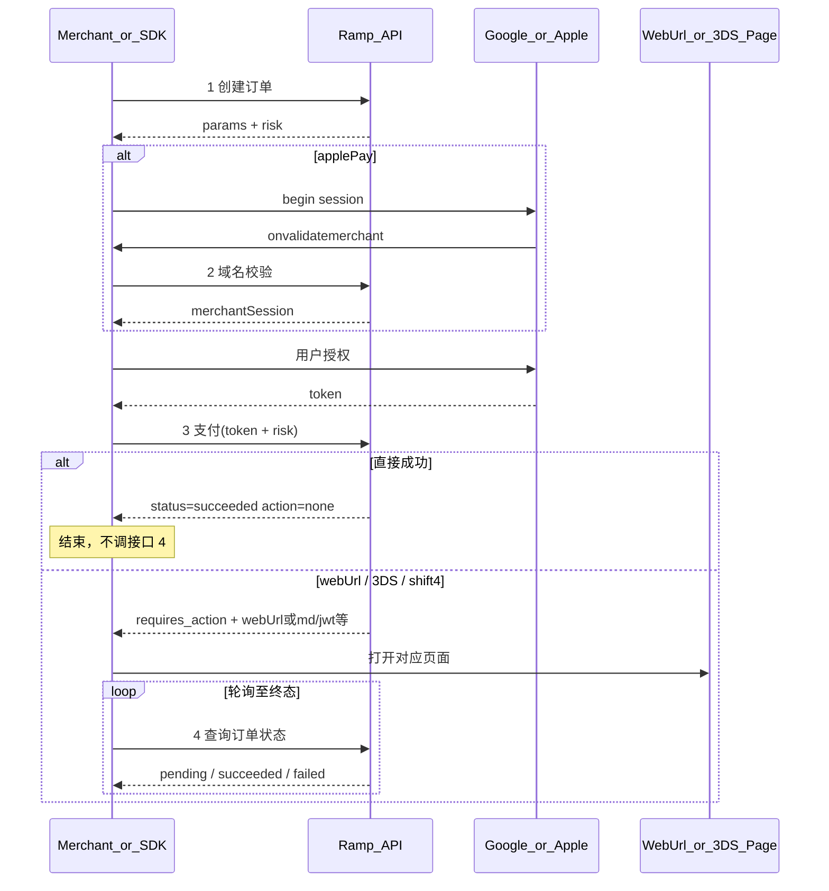

# 钱包唤起与风控参数参考

类型与报文示例按接口拆分在 [`sdk-pay/`](./sdk-pay/)：

| #   | 文件                                                         | 方法     | 类型                                                   | 何时调用                                 |
| --- | ------------------------------------------------------------ | -------- | ------------------------------------------------------ | ---------------------------------------- |
| —   | [`common.ts`](./sdk-pay/common.ts)                           | —        | `ApiResponse` / `OrderStatus` 等                       | 共用                                     |
| 1   | [`1-create-order.ts`](./sdk-pay/1-create-order.ts)           | **POST** | `CreateOrderRequest` → `CreateOrderResponse`           | 下单后拿 `params` / `risk`，渲染钱包按钮 |
| 2   | [`2-validate-merchant.ts`](./sdk-pay/2-validate-merchant.ts) | **POST** | `ValidateMerchantRequest` → `ValidateMerchantResponse` | 仅 `applePay`，`onvalidatemerchant`      |
| 3   | [`3-pay.ts`](./sdk-pay/3-pay.ts)                             | **POST** | `PayRequest` → `PayResponse`                           | 钱包授权 + 风控采集完成后                |
| 4   | [`4-query-order.ts`](./sdk-pay/4-query-order.ts)             | **GET**  | `QueryOrderRequest` → `QueryOrderResponse`             | **仅**接口 3 未直接成功时                |

> 仅接口 4 为 GET（如 `GET /v1/pay/orders/{orderId}`）；其余均为 POST。入口可 `import … from './sdk-pay'`（[`index.ts`](./sdk-pay/index.ts)）。

## 0. 四个接口总览

### 统一响应壳

四个接口共用同一外层结构；**业务字段一律在 `data` 内**。

```json
{
  "success": true,
  "returnCode": "0000",
  "returnMsg": "SUCCESS",
  "extend": "",
  "data": {},
  "traceId": "68b11d63f919cca7adbb4bbe57939df9"
}
```

| 字段         | 说明                                          |
| ------------ | --------------------------------------------- |
| `returnCode` | `'0000'` 成功；**其他值均为失败**             |
| `returnMsg`  | 失败时须向用户/日志吐出（勿忽略）             |
| `success`    | 与 `returnCode` 对应的布尔标记                |
| `data`       | 成功时的业务载荷（见各接口 `*Response` 类型） |
| `extend`     | 扩展字段，可空串                              |
| `traceId`    | 链路追踪，排障用                              |

客户端先判断 `returnCode === '0000'`，再解析 `data`。类型：`ApiResponse<T>` / `isApiSuccess()`（见 [`common.ts`](./sdk-pay/common.ts)）。



**支付结果分支（接口 3 → 是否需要接口 4）：**

| `PayResponse`                                          | 客户端动作         | 是否轮询接口 4    |
| ------------------------------------------------------ | ------------------ | ----------------- |
| `status=succeeded` 且 `action=none`                    | 成功回调           | **否**            |
| `status=failed` 且 `action=none`                       | 失败回调           | **否**            |
| `action=redirect` + `webUrl`                           | 打开 `webUrl`      | **是**（建议 2s） |
| `action=threeDS` + `md` / `jwt` / `threeDSAction`      | 打开 3DS 页        | **是**            |
| `action=shift4Pay` + `threeDSMethodData` / `methodUrl` | 打开 Shift4 方法页 | **是**            |

轮询接口 4 直至 `status` 为 `succeeded` 或 `failed` 后停止。

---

创建订单响应里的 **`params` 即下文 §1–3 之一**：

| `method`    | `params` 形态                                                            | 文档 |
| ----------- | ------------------------------------------------------------------------ | ---- |
| `googlePay` | Google `PaymentDataRequest`，`tokenizationSpecification.type = 'DIRECT'` | §1   |
| `googlePay` | 同上，`type = 'PAYMENT_GATEWAY'`                                         | §2   |
| `applePay`  | Apple Pay `PaymentRequest`；另需 `validateMerchantUrl`（接口 2）         | §3   |

- **§4–5**：风控——创建订单下发配置、支付上送采集结果。

标有「需要替换」的字段须换成商户真实值；标有「可选」的字段按业务需要再带上。  
风控按厂商嵌套：`risk.fingerprint` / `risk.forter` / `risk.checkout` / `risk.worldPay`。  
`enabled === false` 或未下发该块时，对应 SDK **不要**初始化、**不要**采集、支付请求也**不要**带对应字段（或按约定传空串）。  
其余配置字段（`apiKey` / `siteId` 等）：有值用下发值，无值用 SDK 默认——便于服务端热更新，商户不必升 SDK。

---

## 1. Google Pay — DIRECT

`PaymentDataRequest`，令牌化方式为直连解密（自持公钥）。

```js
{
  apiVersion: 2,
  apiVersionMinor: 0,
  allowedPaymentMethods: [
    {
      type: 'CARD',
      parameters: {
        allowedAuthMethods: ['PAN_ONLY', 'CRYPTOGRAM_3DS'],
        allowedCardNetworks: ['MASTERCARD', 'VISA'],

        // 可选，需要账单地址时才有
        billingAddressRequired: true,
        billingAddressParameters: {
          format: 'FULL',
          phoneNumberRequired: false
        }
      },
      tokenizationSpecification: {
        type: 'DIRECT',
        parameters: {
          protocolVersion: 'ECv2',
          publicKey: 'your publicKey' // 需要替换
        }
      }
    }
  ],
  transactionInfo: {
    countryCode: 'US', // 需要替换
    currencyCode: 'USD', // 需要替换
    totalPriceStatus: 'FINAL',
    totalPrice: '10.00', // 需要替换
    totalPriceLabel: 'Total'
  },
  merchantInfo: {
    merchantId: 'your merchantId', // 需要替换；TEST 环境可省略，PRODUCTION 必填
    merchantName: 'your merchantName' // 需要替换
  },

  // 可选。不传则 loadPaymentData() 直接返回 paymentData（含 token）。
  // 若传 PAYMENT_AUTHORIZATION，必须同时：
  // 1. 创建 PaymentsClient 时提供 paymentDataCallbacks.onPaymentAuthorized
  // 2. 在回调里调后端处理 token，再 resolve({ transactionState: 'SUCCESS' | 'ERROR' })
  // 否则支付 sheet 会失败或卡住。不需要授权回调时不要带本字段。
  callbackIntents: ['PAYMENT_AUTHORIZATION']
}
```

---

## 2. Google Pay — PAYMENT_GATEWAY

与上一节相同，仅 `tokenizationSpecification` 改为走支付网关。

```js
{
  apiVersion: 2,
  apiVersionMinor: 0,
  allowedPaymentMethods: [
    {
      type: 'CARD',
      parameters: {
        allowedAuthMethods: ['PAN_ONLY', 'CRYPTOGRAM_3DS'],
        allowedCardNetworks: ['MASTERCARD', 'VISA'],

        // 可选，需要账单地址时才有
        billingAddressRequired: true,
        billingAddressParameters: {
          format: 'FULL',
          phoneNumberRequired: false
        }
      },
      tokenizationSpecification: {
        type: 'PAYMENT_GATEWAY',
        parameters: {
          gateway: 'your gateway', // 需要替换
          gatewayMerchantId: 'your gatewayMerchantId' // 需要替换
        }
      }
    }
  ],
  transactionInfo: {
    countryCode: 'US', // 需要替换
    currencyCode: 'USD', // 需要替换
    totalPriceStatus: 'FINAL',
    totalPrice: '10.00', // 需要替换
    totalPriceLabel: 'Total'
  },
  merchantInfo: {
    merchantId: 'your merchantId', // 需要替换；TEST 环境可省略，PRODUCTION 必填
    merchantName: 'your merchantName' // 需要替换
  },

  // 可选。不传则 loadPaymentData() 直接返回 paymentData（含 token）。
  // 若传 PAYMENT_AUTHORIZATION，必须同时：
  // 1. 创建 PaymentsClient 时提供 paymentDataCallbacks.onPaymentAuthorized
  // 2. 在回调里调后端处理 token，再 resolve({ transactionState: 'SUCCESS' | 'ERROR' })
  // 否则支付 sheet 会失败或卡住。不需要授权回调时不要带本字段。
  callbackIntents: ['PAYMENT_AUTHORIZATION']
}
```

---

## 3. Apple Pay — PaymentRequest

创建 `ApplePaySession` 时传入的支付请求。

```js
{
  countryCode: 'US', // 需要替换
  currencyCode: 'USD', // 需要替换
  merchantCapabilities: ['supports3DS', 'supportsCredit', 'supportsDebit'],
  supportedNetworks: ['masterCard', 'visa'],
  total: {
    label: 'ALCHEMY GPS EUROPE UAB',
    type: 'final',
    amount: '10.00' // 需要替换
  },
  // 可选，需要账单地址时才有
  requiredBillingContactFields: ['name', 'postalAddress', 'phone', 'email']
}
```

### 商户域名校验（接口 2）

`method === 'applePay'` 时，创建订单响应须带（**不在** `params` 内）：

```js
validateMerchantUrl: 'https://api.example.com/v1/pay/apple-pay/validate-merchant'
```

`onvalidatemerchant` 中向该 URL 提交 `ValidateMerchantRequest`（含 Apple 的 `validationURL`）。  
响应为统一壳；`returnCode === '0000'` 时 `data` 为 Apple opaque session，客户端 `completeMerchantValidation(response.data)`。详见 [`2-validate-merchant.ts`](./sdk-pay/2-validate-merchant.ts)。

---

## 4. 风控 — 创建订单下发（开关与初始化配置）

属于**接口 1** 响应字段：`orderId` + `method` + `params`（§1–3）+ `risk`（`environment` 可选；Apple 另加 `validateMerchantUrl`）。  
完整请求见 `CreateOrderRequest`。`risk` 按厂商嵌套：

| 路径                    | 含义                            |
| ----------------------- | ------------------------------- |
| `risk.<vendor>.enabled` | 是否采集                        |
| `risk.<vendor>.*`       | 初始化配置（有值覆盖 SDK 默认） |

```js
{
  orderId: 'ord_xxx',
  environment: 'TEST', // 可选；'TEST' | 'PRODUCTION'，不传默认 'PRODUCTION'
  method: 'googlePay', // | 'applePay'
  params: {
    /* §1–3 钱包原生请求 */
  },
  // validateMerchantUrl: 'https://...', // 仅 applePay
  risk: {
    fingerprint: {
      enabled: true,
      apiKey: 'your fingerprint apiKey',
      scriptUrlPattern: ['https://fp.example.com/web/v3/yourApiKey/loader_v3.9.9.js'],
      endpoint: ['https://fp.example.com']
    },
    forter: {
      // https://docs.forter.com/front-end-integration
      enabled: true,
      siteId: 'your forter siteId'
    },
    checkout: {
      // https://www.checkout.com/docs/business-operations/prevent-fraud/integrate-with-risk-js
      enabled: true,
      publicKey: 'your checkout public key'
    },
    worldPay: {
      enabled: true,
      jwt: 'your worldPayJwt'
    }
  }
}
```

配置合并示意：

```js
const fpCfg = risk.fingerprint || {}
const apiKey = fpCfg.apiKey || SDK_DEFAULTS.fingerprint.apiKey
const scriptUrlPattern = [
  ...(fpCfg.scriptUrlPattern?.length
    ? fpCfg.scriptUrlPattern
    : SDK_DEFAULTS.fingerprint.scriptUrlPattern),
  FingerprintJS.defaultScriptUrlPattern
]
const endpoint = [
  ...(fpCfg.endpoint?.length ? fpCfg.endpoint : SDK_DEFAULTS.fingerprint.endpoint),
  FingerprintJS.defaultEndpoint
]

const fp = await FingerprintJS.load({ apiKey, scriptUrlPattern, endpoint })
const { visitorId } = await fp.get()
// 上送 risk.fingerprint.visitorId；可缓存 localStorage，失败可传 ""
```

| 块                 | `enabled` 时动作                                             | 可覆盖字段                               |
| ------------------ | ------------------------------------------------------------ | ---------------------------------------- |
| `risk.fingerprint` | `FingerprintJS.load`，取 `visitorId`                         | `apiKey`、`scriptUrlPattern`、`endpoint` |
| `risk.forter`      | 初始化 Forter，支付前取 token                                | `siteId`                                 |
| `risk.checkout`    | 初始化 Risk.js，支付前 `publishRiskData()` / `publishData()` | `publicKey`                              |
| `risk.worldPay`    | Cardinal DDC 隐藏 iframe，取 `sessionId`（建议超时约 10s）   | `jwt`                                    |

> 若服务端走服务端风控、无需前端采集（类比收银台 `s2sRiskCheck === true`），将各 `enabled` 置 `false`，或不下发对应块。

---

## 5. 支付接口上送与结果分支（接口 3 + 4）

### 5.1 请求（风控采集结果）

调用**接口 3** 时，在钱包 `token` / `billingAddress` 之外，按 §4 的 `enabled` 附带采集结果。  
`enabled === false` 时省略对应块；采集失败是否允许空串由服务端约定。  
类型：`PayRequest`（见 [`3-pay.ts`](./sdk-pay/3-pay.ts)）。

```js
{
  orderId: 'ord_xxx',
  method: 'googlePay',
  token: '...', // Google Pay token 字符串，或 Apple Pay payment.token
  billingAddress: {
    /* 开启账单地址时带上 */
  },
  risk: {
    fingerprint: { visitorId: 'your visitor id' },
    forter: { token: 'your forter token' },
    checkout: { deviceSessionId: 'dsid_...' },
    worldPay: { sessionId: 'your worldPay sessionId' }
  }
}
```

| 上送字段                        | 对应开关                   | 说明                            |
| ------------------------------- | -------------------------- | ------------------------------- |
| `risk.fingerprint.visitorId`    | `risk.fingerprint.enabled` | Fingerprint `visitorId`         |
| `risk.forter.token`             | `risk.forter.enabled`      | Forter 前端 token               |
| `risk.checkout.deviceSessionId` | `risk.checkout.enabled`    | Checkout `deviceSessionId`      |
| `risk.worldPay.sessionId`       | `risk.worldPay.enabled`    | WorldPay / Cardinal DDC session |

建议时序：接口 1 拿到 `risk` → 尽早初始化 → 用户确认支付前取最新 token / session → 调接口 3。

### 5.2 响应与是否轮询

`PayResponse` 示例见 [`3-pay.ts`](./sdk-pay/3-pay.ts)；轮询见 [`4-query-order.ts`](./sdk-pay/4-query-order.ts)。

- **直接成功**：`status=succeeded` + `action=none` → 结束，**不要**调接口 4。
- **需二次动作**：返回 `webUrl`，或 `md`+`jwt`+`threeDSAction`，或 `threeDSMethodData`+`methodUrl` → 创建/打开对应页面，并**轮询接口 4**（`QueryOrderRequest`）直到 `succeeded` / `failed`。

---

## 备注

- 顶层 `environment`（`TEST` / `PRODUCTION`）可选，**不传默认 `PRODUCTION`**：Google Pay 创建 `PaymentsClient`、以及各风控 SDK 均读此字段；不在 `params` 内。
- 不使用 `PAYMENT_AUTHORIZATION` 时，可省略 `callbackIntents`，由 `loadPaymentData` 一次性返回 token。
- 路径 `/v1/pay/...` 为建议值，以实际网关为准；**仅查询订单为 GET，创建订单 / 域名校验 / 支付均为 POST**；统一响应壳见 §0（`returnCode === '0000'` 成功）。
- 与现有 payment-hub 旧字段的映射由服务端完成；商户侧以本文 / [`sdk-pay/`](./sdk-pay/) 为准。
